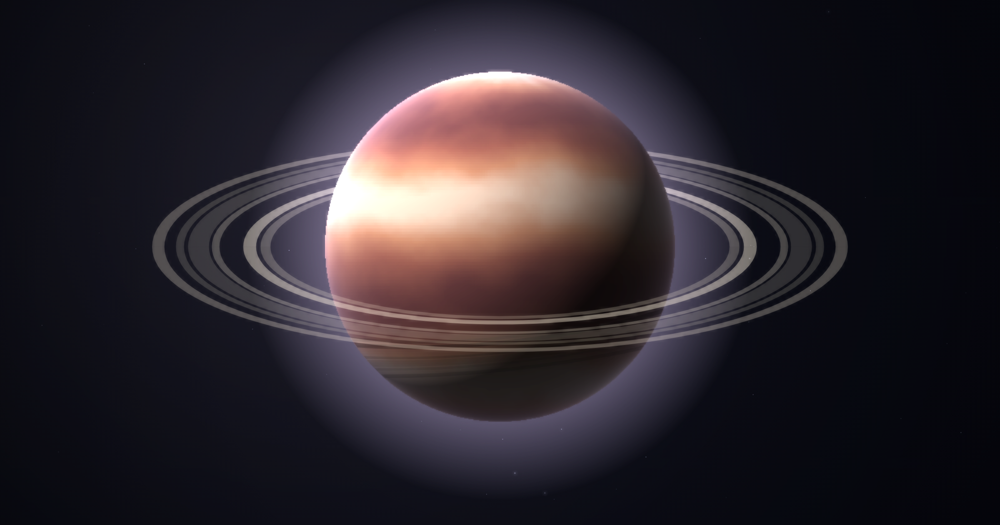
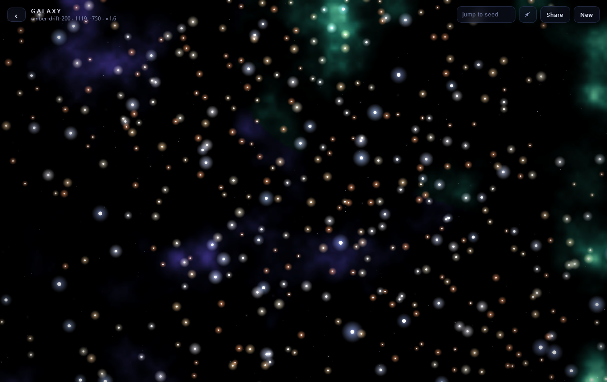
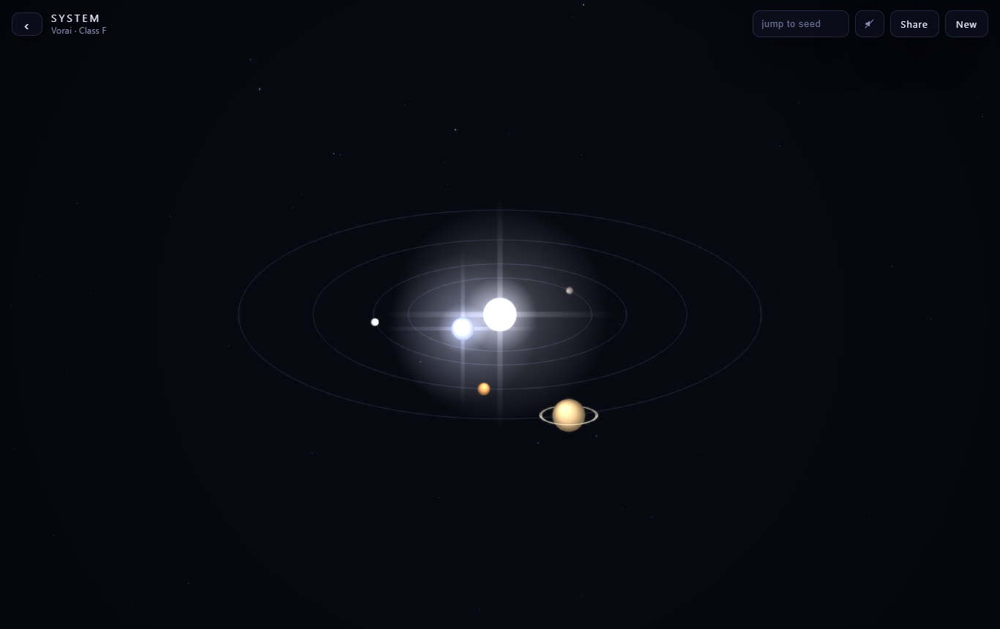
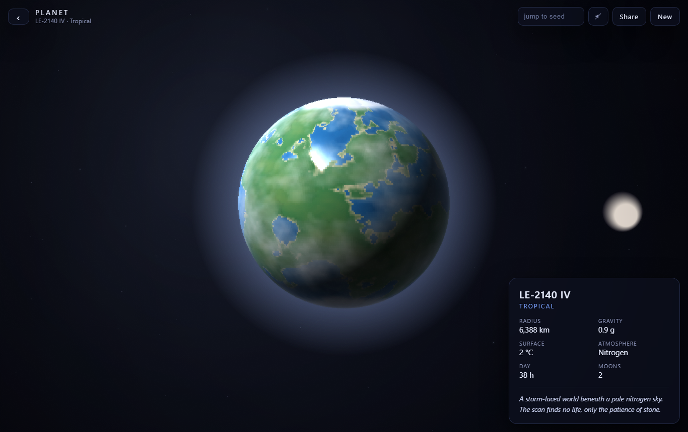

# Aether

An infinite universe you can fly through, all grown from a single seed.



Aether is a small, self contained space explorer that runs in the browser. Pan around an endless galaxy, warp into a star system, drop onto a planet and scan it. Every star, world, ring, name and line of lore is generated from maths at runtime. There are no downloaded images, models or audio anywhere in the
project, and the whole thing is plain HTML, CSS and vanilla JavaScript drawing to a 2D canvas. The 3D look (lit planets, atmospheres, drifting clouds, ring shadows, warps) is all done with 2D tricks and cached offscreen canvases, so it stays light enough to run at 60fps on a phone.

The same seed always rebuilds the same universe, and the share button hands you a link that drops someone into the exact spot you were looking at.

## Controls

- Drag to pan around the galaxy
- Scroll or pinch to zoom
- Hover a star to read its name, click or tap to warp in
- Click a planet to approach and scan it
- Back button or Escape to step back out
- Jump to seed box (top bar) to teleport to a different universe
- The speaker icon toggles a soft ambient drone. It is off by default.

## Run it locally

There is no build step. You just need to serve the folder over http, because the code uses ES modules and browsers will not load those off the file system.

```
python -m http.server 8099
```

Then open http://localhost:8099/. Any static server works, for example
`npx serve` for Node.

## How the seed and share links work

A seed is just a word or phrase. It is hashed to a 32 bit number that feeds a small PRNG, and every position in space is hashed by its coordinates, so the galaxy is effectively infinite and identical for a given seed every time. Type a seed, or hit random, and you get a whole universe to yourself.

The current seed and where you are looking are kept in the URL after the `#`. Copy the link with the Share button and whoever opens it lands on the same world, in the same universe. Nothing is stored on a server.





## Layout

```
index.html      page shell, canvas, intro and HUD
styles.css      all the styling
src/
  main.js       loop, camera, input, scene switching, warps, post effects
  rng.js        seeded PRNG and coordinate hashing
  noise.js      value noise and fbm helpers
  galaxy.js     the infinite star map and nebulae
  system.js     star systems, orbits, belts, binaries
  planet.js     planet baking, lighting, clouds, rings, moons
  lore.js       names and lore from seeded word banks
  ui.js         intro, HUD, scan panel
  share.js      reading and writing the URL state
  audio.js      the optional ambient drone
```